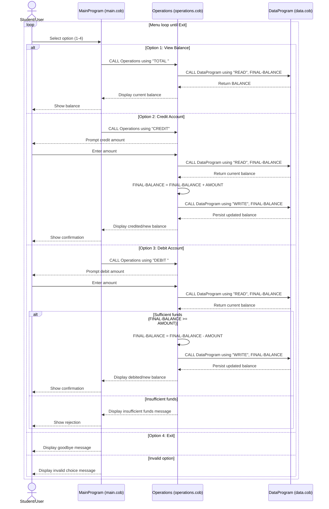

# COBOL Student Account System Documentation

This document describes the COBOL programs in `src/cobol` and the business rules used to manage student accounts.

## Overview

The system is split into three COBOL programs:

- `main.cob`: user interface and menu flow.
- `operations.cob`: account operation logic (view, credit, debit).
- `data.cob`: account balance storage access (read/write).

Together, these files implement a simple console-based account management flow for student balances.

## File Purposes and Key Functions

### `src/cobol/main.cob` (`PROGRAM-ID. MainProgram`)

Purpose:
- Acts as the entry point of the application.
- Displays the account menu and captures the user choice.

Key behavior:
- Repeats a menu loop until the user chooses Exit.
- Calls `Operations` with a 6-character operation code:
- `TOTAL ` to view balance.
- `CREDIT` to add funds.
- `DEBIT ` to subtract funds.
- Validates menu options and shows an error for invalid choices.

### `src/cobol/operations.cob` (`PROGRAM-ID. Operations`)

Purpose:
- Applies business operations to a student account balance.
- Coordinates with `DataProgram` to read/update stored balance.

Key behavior:
- `TOTAL `:
- Calls `DataProgram` using `READ` and displays current balance.
- `CREDIT`:
- Prompts for amount, reads current balance, adds amount, writes new balance.
- `DEBIT `:
- Prompts for amount, reads current balance, validates available funds, subtracts amount only when allowed, writes new balance.
- Displays confirmation/error messages after each operation.

### `src/cobol/data.cob` (`PROGRAM-ID. DataProgram`)

Purpose:
- Encapsulates account balance storage logic.
- Provides a simple read/write data interface to other programs.

Key behavior:
- Stores the current balance in `STORAGE-BALANCE` (initialized to `1000.00`).
- Accepts operation type through linkage (`READ` or `WRITE`).
- `READ`: moves stored balance to output `BALANCE`.
- `WRITE`: updates stored balance from input `BALANCE`.

## Student Account Business Rules

The current implementation enforces these rules:

1. A student account starts with a default balance of `1000.00`.
2. Supported actions are: view balance, credit account, debit account, and exit.
3. Credits increase the account balance by the entered amount.
4. Debits are only allowed when `balance >= debit amount`.
5. If funds are insufficient, the balance is not changed and an error message is shown.
6. Balance changes are persisted by writing through `DataProgram`.
7. Operation commands are fixed-width 6-character codes (`TOTAL `, `CREDIT`, `DEBIT `, `READ`, `WRITE`).

## Data and Numeric Considerations

- Balance and transaction amounts use `PIC 9(6)V99`.
- This implies up to 6 integer digits and 2 decimal digits.
- Input validation for non-numeric or negative amounts is not implemented yet.

## Current Limitations

- Single in-memory balance only (no file or database persistence).
- No student identifier; all operations affect one shared account balance.
- No audit trail or transaction history.
- Minimal input validation.

## Sequence Diagram (Data Flow)

